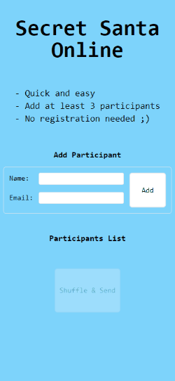

# Secret Santa Online

This project is a simple web application made with Vue.js using Tailwind as CSS framework. This is a tool for generating secret santa groups and sending email notifications to participants.



[You can use it here](https://quicksecretsanta.web.app/)

## Features

* Accepts a list of names and email addresses as input
* Randomly assigns each person to another person in the group as their secret santa
* Sends an email notification to each person with the name and email address of their secret santa

## Installation

Clone the repository:
```
git clone https://github.com/9uifranco/secret-santa-online.git
```

Install dependencies:

```
npm install
```
## Setup

Since it uses [smtp.js](https://smtpjs.com/) to send emails you will have to setup your SMTP server. That's the easiest way to do that:

1. Create an account in [Elastic Email](https://elasticemail.com/)

2. Go to *Settings > Create SMTP credentials*. Then fill up the form and save the password you're going to receive.

3. Then go to *Domains > Manage Domains*. Click on the button *Start verification* in your top right and choose the option *I don't own a domain*. By choosing this option you will verify your email address.

4. Finally you will have to encrypt your SMTP credentials. Go to [smtp.js website](https://smtpjs.com/) and click on *Security* at the top menu. Click on the *Encrypt your SMTP credentials* button, fill up the form and get the Secure Token.

5. Create this .env file on the root of the project:

```
VITE_SECURE_TOKEN=yoursecuretoken
VITE_EMAIL=youremail@email.com
```
6. And now you are ready to run the development server

```
npm run dev
```